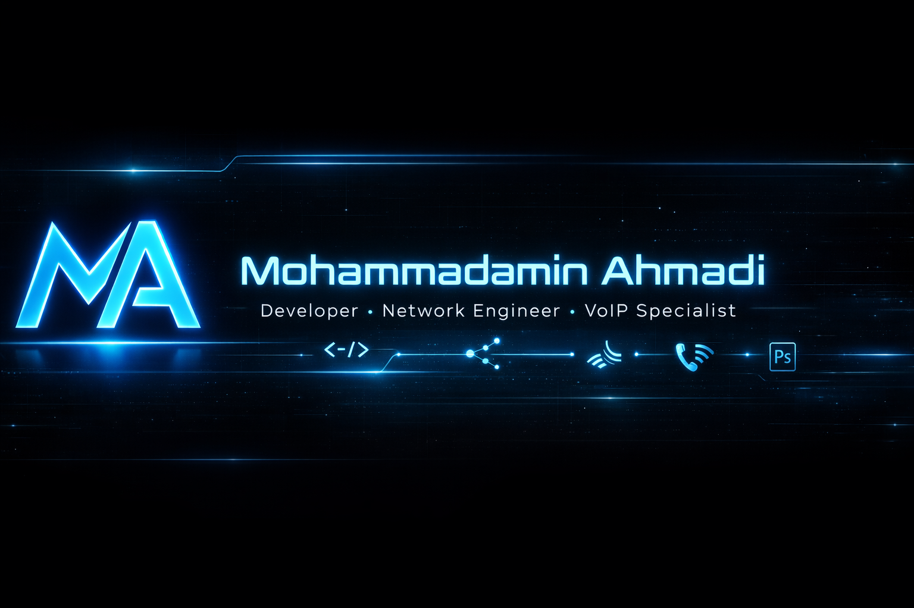

<!-- LOGO -->

  

<!-- BANNER -->

  <!--  -->

<h1 align="center" style="color:white;">✨ Mohammadamin Ahmadi ✨</h1>
<h3 align="center" style="color:white;">💻 Developer | 🎨 Designer | 🌐 Network & VoIP Specialist</h3>

  

---

## 🧑‍💻 About Me
- 🔥 Developer with experience in **C#**, **Python**, and **Flutter**
- 🎨 Professional **Photoshop** designer
- 🌐 Skilled in **Cisco Packet Tracer**, **MikroTik**, Firewall & Mangle
- ☎️ Experienced in **VoIP**, SIP, and **Issabel Server**

---

## 🧠 Skill Levels

| Skill           | Level |
|-----------------|-------|
| Photoshop       | ████████████████████░░ 90% |
| MikroTik        | ████████████░░░░░░░░░░ 68% |
| VoIP / Issabel  | █████████████████░░░░ 85% |
| C#              | ███████████░░░░░░░░░░░ 60% |
| Python          | ████████████░░░░░░░░░░ 65% |
| Flutter         | ██████████░░░░░░░░░░░░ 55% |
| Networking      | ███████████████░░░░░░░ 75% |

---

## 🧰 Tech Stack

### 💻 Programming

### 🎨 Graphic Design

### 🌐 Network & VoIP

### 🛠 Tools

---

## 📊 GitHub Analytics

### 🔥 Activity Graph

## 🌐 Contact Me

📧 Email: **mhmdamymahmdy123@gmail.com**  
📱 Phone: **+989397672152**

---

<h3 align="center" style="color:#00C8FF;"> Thanks for visiting my profile </h3>
